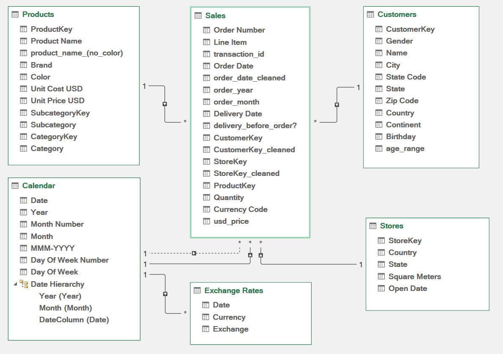
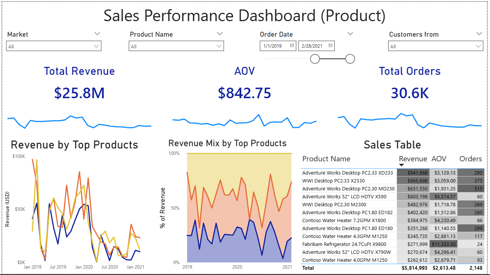
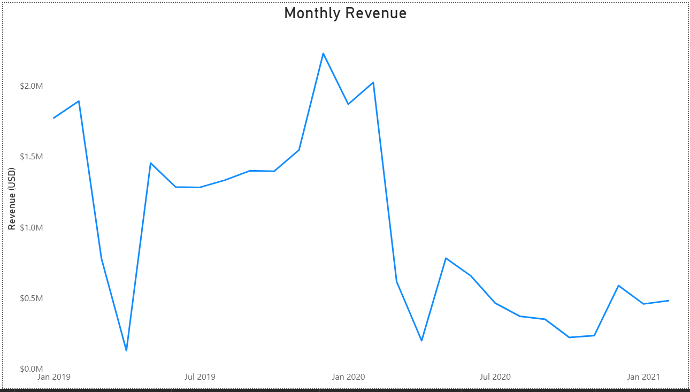
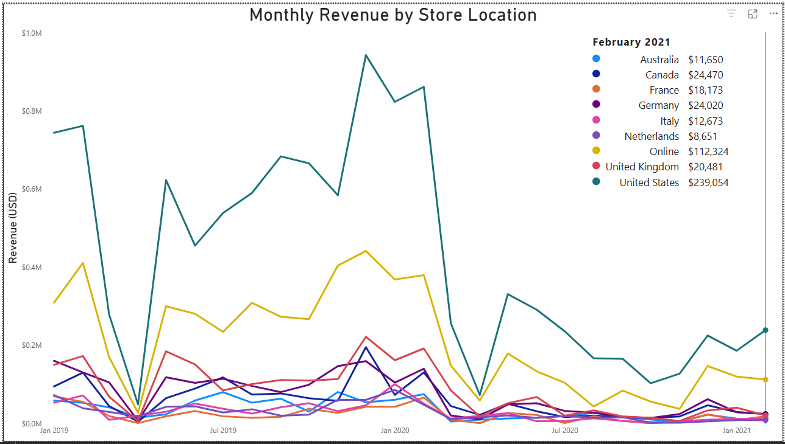
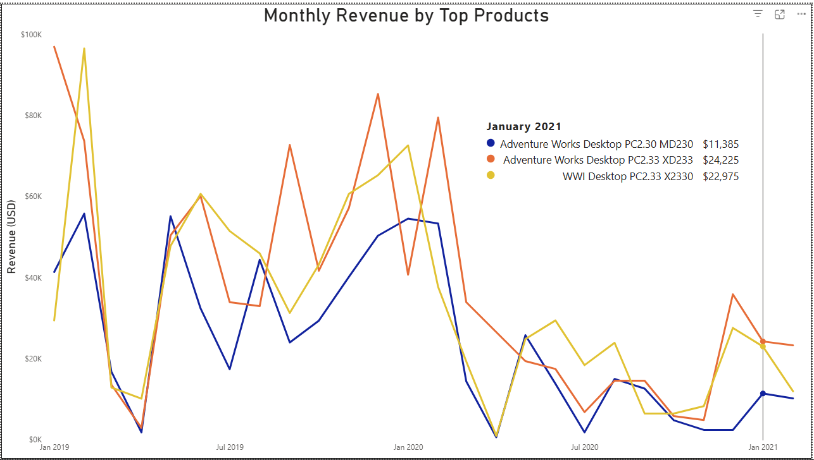
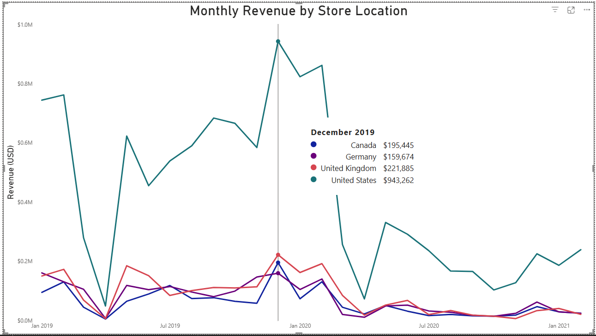
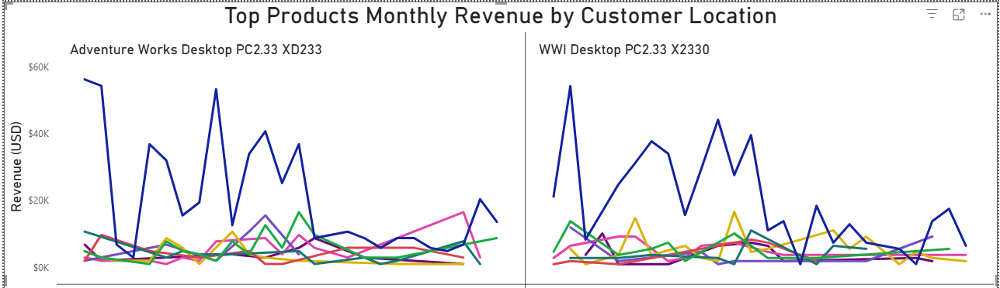

# VoltEdge Solutions: Global Sales Performance Analysis (2019-2021)

## Project Background
VoltEdge Solutions is a global electronics retailer specializing in high-performance computing hardware and consumer electrical products. As a Data Analyst, I conducted a comprehensive review of the sales performance from 2019 to 2021. The company operates through an **e-commerce platform and a network of physical stores, with multiple stores located in each country of operation**. 

The objective of this project was to analyze revenue trends, evaluate the impact of global market shifts (including the COVID-19 pandemic), and identify product-level optimization opportunities to drive commercial success.

Insights and recommendations are provided on the following key areas:
- **Sales Trend Analysis:** Evaluation of historical revenue patterns and the significant fluctuations of 2020.
- **Product Performance:** Assessment of top-tier desktop models versus underperforming categories.
- **Geographical & Market Expansion:** Analysis of revenue concentration in the US versus international markets.
- **Channel & Customer Insights:** Evaluation of sales performance across the online platform and physical stores.

The Excel file used to clean, prepare, model the data and do initial Exploratory Data Analysis (EDA) can be found [here](/voltedge_analysis_excel.zip).  

The Power BI dashboard used to report and explore these sales trends in depth can be found [here](/voltedge_analysis_power_bi.pbix).

## Data Structure
The company's database structure consists of five main tables with a fact-dim architecture:
- **Sales (Fact Table):** Transactional data including order dates, product key and quantities.
- **Products (Dim Table):** Product details, categories, cost, and price.
- **Customers (Dim Table):** Demographic data (gender, location, and age range).
- **Stores (Dim Table):** Details of each store including country and state.
- **Exchange Rates:** Daily currency exchange data for global transactions.  

## Executive Summary

### Overview of Findings
Total revenue across 2019-2021 reached **$25.8M**, characterized by extreme volatility: a massive peak in December 2019 followed by a sharp **90% drop** between February and April 2020. While revenue stabilized later, sales remained heavily concentrated in the US market. A significant insight is that despite having physical stores in each country, the Online platform remains the 2nd primary driver for specific high-value products after US market.  

The following interactive dashboard can be found [here](/voltedge_analysis_power_bi.pbix).  

  

## Insights Deep Dive

### Sales Trends & Macro Impact
* **The 2019 Peak:** Total sales spiked significantly in December 2019, driven by holiday season promotions and strong pre-pandemic consumer spending.
* **The Pandemic Shock:** Sales plummeted by approximately 90% from February to April 2020. This dip was consistent across the Online platform and all stores, indicating a global macro-economic impact.
* **Post-Recovery Plateau:** Following the initial recovery, sales for top products plateaued in early 2021, suggesting a shift in consumer behavior or supply chain constraints.  

  

### Product Level Performance
* **Desktop Dominance:** The **Adventure Works Desktop PC2.33 XD233** is the flagship product, generating nearly **$942K** in total sales. 
* **The "Fan" Failure:** The Fans subcategory is the worst-performing, contributing **less than 0.2%** of overall revenue ($15 total sales for some models), indicating a potential inventory or data tracking issue.
* **Entertainment Traction:** Data shows a greater willingness to spend on entertainment-related electrical products during lockdown periods.  

  

### Geographical & Market Analysis
* **US Market Concentration:** The US market is the primary revenue driver, generating **42.6%** of total revenue across 2019-2021.
* **International Gap:** Each other country (including UK, Germany and Canada) generated **less than 9%** of total revenue, despite each having multiple stores distributed among states.
* **Regional Resilience:** UK, Germany and Canada show the highest potential for growth among international markets, generating **8.5%, 7.4% and 6.2%** of total revenue respectively.  

  

### Channel & Customer Insights
* **Channel Comparison:** The **Online Platform** and the **US Market** are the highest contributors to total revenue. Online Platform generated **~20%** of total revenue.
* **Specific Products Dips:** The **WWI Desktop PC2.33 X2330** saw a disproportionately sharp decline by customers located in US compared to other customers. A similar decline also seen by **Adeventure Works Desktop PC2.33 XD233**, suggesting targeted competitor pressure in the US market.  
* **Global Consistency:** The 2020 decline was not isolated to one channel; the Online platform and all stores exhibited the same downward trend simultaneously.  

  

## Recommendations:
* **Inventory Optimization:** Immediately **remove Fans from the inventory**, as they contribute negligible revenue **(<0.2%)** and consume valuable resources.
* **Channel-Specific Marketing:** Investigate the decline of the **Adventure Works Desktop** in the Online channel to determine if website placement or digital competitors are the cause.
* **International Store Growth:** Launch targeted marketing campaigns in **UK, Germany and Canada** to increase the foot traffic and sales volume of the stores in those countries.
* **Seasonal Strategy:** Double down on **Winter sales** (October - December) to replicate the successful 2019 peak.

## Assumptions and Caveats:
* **Data Quality Exclusions:** **7%** of records, containing **missing order dates**, or **missing/zero/non-sensical quantities**, were excluded from the analysis to ensure data integrity.
* **Missing Product Data:** Low sales for "Fans" may indicate data gaps; a sanity check with the data team is recommended.
